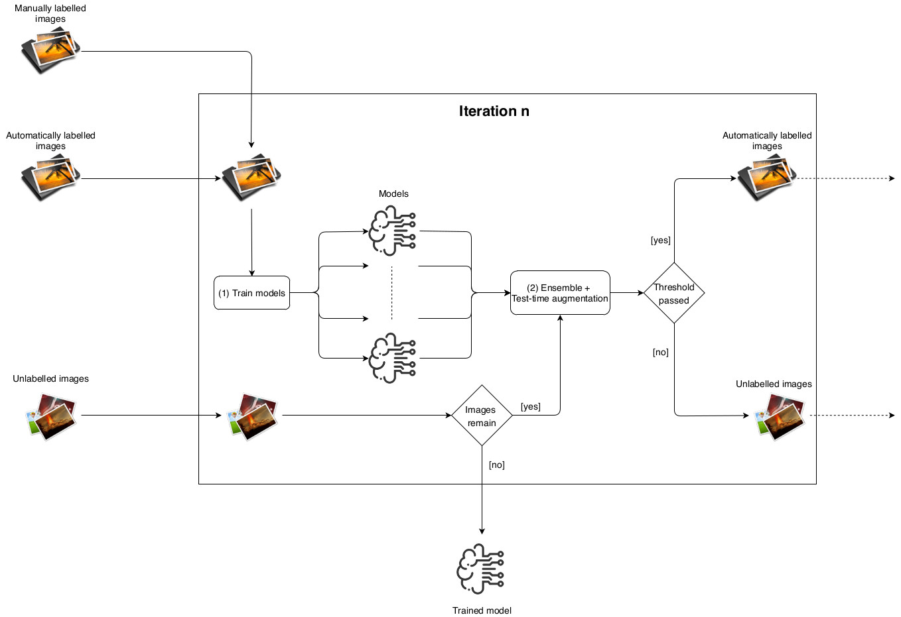

# AutoML using Transfer and Semi-Supervised Learning

This repository includes the code, application, and notebooks for the work "AutoML using Transfer and Semi-Supervised Learning". 
The tools presented here can be employed to construct image classification models with small datasets using transfer learning.
In addition, we present a new semi-supervised learning procedure for constructing image classification models with partially 
annotated datasets. 

## Workflow

The workflow of our method is summarised in the following figure, and it is described in detail in a [draft paper](assets/draft.pdf).

## Notebooks

The workflow can be executed using with a user's dataset by adapting a [Colab notebook](). Such a notebook can be run also locally 
provided that the user has installed the Python packages indicated in the [requirements file](assets/requirementsFastAI.txt).

## Application

We have also developed a Java application that guides the user in all the stages of the construction of an image classification model using our workflow; 
namely, it helps to annotate the images, train a model, test it, and finally use it. The source code of this application is provided
in this repository, and the application can be downloaded from the following [link]().

## Experiments

We have conducted several experiments with our method. A detailed description of such experiments is provided in the [draft paper](assets/draft.pdf).

### Comparison with other AutoML tools

We have compared our method with several AutoML tools using [6 small datasets](https://ome.grc.nia.nih.gov/iicbu2008/). The results are provided in the following table.

|| Binucleate |Cho | Hela | Lymphoma | Pollen| RNAI |
|-----------|-----------|-----------|-----------|-----------|-----------|-----------|
 [AutoKeras](https://autokeras.com/) | 0.55 | 0.96 | 0.47 | 0.89 | 0.81 | 0.24|
 [Devol](https://github.com/joeddav/devol) | 0.54 | 0.75 | 0.68 | 0.55 | 0.89 | 0.28|
 [FrImCla](https://github.com/ManuGar/FrImCla) | 1.00 | 0.98 | 0.82 | 0.86 | 0.96 | 0.69|
 [Ludwig](https://uber.github.io/ludwig/) | 0.54 | 0.64 | 0.51 | 0.57 | 0.58 | 0|
 [WND-CHARM](https://github.com/wnd-charm/wnd-charm) | 1.00 | 0.95 | 0.88 | 0.79 | 0.96 | 0.66|
||||||||
Our method ResNet34 | 0.9 | 0.91 | 0.98 | 0.8 | 0.96 | 0.54|
Our method ResNet50 | 1.00 | 0.91 | 0.98 | 0.91 | 0.94 | 0.64|
Our method ResNet101 | 1.00 | 0.95 | 0.97 | 0.8 | 0.96 | 0.74|
Our method DenseNet121 | 1.00 | 0.92 | 0.96 | 0.93 | 0.96 | 0.62|

### Results with partially annotated datasets

We have also shown the benefits of using our semi-supervised learning method in three different datasets and taking differents amounts of annotated images; namely 25, 50 and 75 images per class. 

#### [Plant Seedlings dataset](https://arxiv.org/abs/1711.05458)

Best accuracy using the whole dataset (4125 images): 96.16%

Results using part of the dataset and applying our method with different strategies. 
  | | N.D. | D.D. | I.D.D. | M.D. | I.M.D. | M.D.D. | I.M.D.D. |
|------|------|------|------|------|------|------|------|
  |25 per class | 0.8348 | 0.8688 | 0.8906 | 0.8833 | \textbf{0.9167 | 0.8819 | 0.9130|
  |50 per class | 0.8905 | 0.9174 | \textbf{0.9355 | 0.9341 | 0.9341 | 0.9261 | 0.9304|
  |75 per class | 0.9137 | 0.9282 | 0.9399 | 0.9413 | **0.9514** | 0.9399 | 0.9500|

#### [Kvasir dataset](http://doi.acm.org/10.1145/3083187.3083212)

#### [ISIC dataset](https://arxiv.org/abs/1902.03368)

A java application that allows users to annotate datasets and creates classification models automatically.
